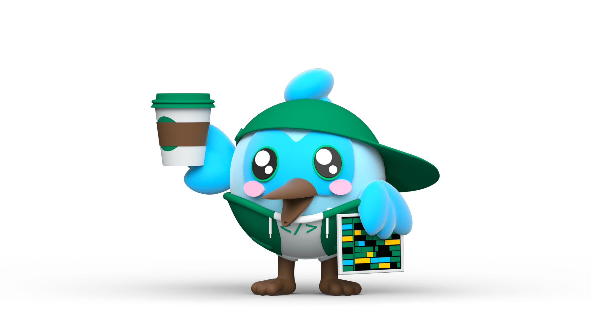
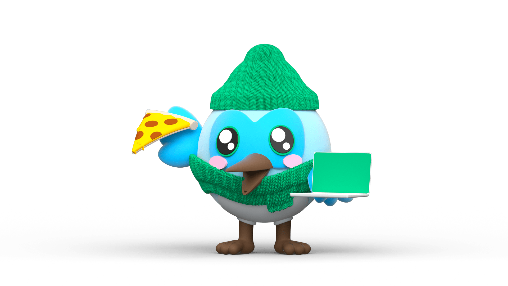

<h1 align='center'>
  Hi there 👋 I'm Med Redha 👨‍💻
</h1>

  ...& I'm a Mobile Developer / UI/UX Designer.
  
  

  
  &nbsp;&nbsp;
  &nbsp;&nbsp;
  

  

  

<h4 align='center'>
  Do you like my open source projects? <a href='https://stars.github.com/nominate/'>Nominate me to Github Stars 🥳</a>
   

   
  Buy me a Coffee ☕️ 
    
  
  
</h4>

</b> 

  <b align='center'>💻 Dev Passions 🤩</b>  
  
  
  
  
  
  
  
  
  
  
  
  
  
  
  
  
  
  
  
  
  
  
  
  
  
  
    
  <b align='center'>🎨 Design Passions 🤩</b>  
  
  
  
  
  
  
  
  
  

</b> 

  
📫 How to reach me

  

    
     
  

  
📈 Some GitHub Metrics

    

    

<h3 align='center'>
  😂 Here! A Nerd joke for you!
</h3>

  

